# Beads Export

*Generated: Fri, 30 Jan 2026 16:28:20 EST*

## Summary

| Metric | Count |
|--------|-------|
| **Total** | 61 |
| Open | 60 |
| In Progress | 1 |
| Blocked | 0 |
| Closed | 0 |

## Quick Actions

Ready-to-run commands for bulk operations:

```bash
# Close all in-progress items
bd close nyc-bike-urbanflow-91i

# Close open items (60 total, showing first 10)
bd close nyc-bike-urbanflow-gtk.17 nyc-bike-urbanflow-gtk.12 nyc-bike-urbanflow-gtk.10 nyc-bike-urbanflow-gtk.6 nyc-bike-urbanflow-gtk.5 nyc-bike-urbanflow-gtk.4 nyc-bike-urbanflow-gtk.3 nyc-bike-urbanflow-gtk.1 nyc-bike-urbanflow-0ag nyc-bike-urbanflow-lav

# View high-priority items (P0/P1)
bd show nyc-bike-urbanflow-gtk.17 nyc-bike-urbanflow-gtk.12 nyc-bike-urbanflow-gtk.10 nyc-bike-urbanflow-gtk.6 nyc-bike-urbanflow-gtk.5 nyc-bike-urbanflow-gtk.4 nyc-bike-urbanflow-gtk.3 nyc-bike-urbanflow-gtk.1 nyc-bike-urbanflow-0ag nyc-bike-urbanflow-lav nyc-bike-urbanflow-a85 nyc-bike-urbanflow-skp nyc-bike-urbanflow-9gd nyc-bike-urbanflow-9pz nyc-bike-urbanflow-3ln nyc-bike-urbanflow-5gw nyc-bike-urbanflow-dy7 nyc-bike-urbanflow-mzx nyc-bike-urbanflow-an0 nyc-bike-urbanflow-lfj nyc-bike-urbanflow-2zn nyc-bike-urbanflow-3jd nyc-bike-urbanflow-zjr nyc-bike-urbanflow-av9 nyc-bike-urbanflow-l3m nyc-bike-urbanflow-gtk nyc-bike-urbanflow-91i

```

## Table of Contents

- [🟢 nyc-bike-urbanflow-gtk.17 sv storage tables + token rotation](#nyc-bike-urbanflow-gtk-17)
- [🟢 nyc-bike-urbanflow-gtk.12 Reliability marts + episodes tables](#nyc-bike-urbanflow-gtk-12)
- [🟢 nyc-bike-urbanflow-gtk.10 Station endpoints + series API](#nyc-bike-urbanflow-gtk-10)
- [🟢 nyc-bike-urbanflow-gtk.6 Web e2e tests (playback + inspect + MapShell)](#nyc-bike-urbanflow-gtk-6)
- [🟢 nyc-bike-urbanflow-gtk.5 Policy unit tests + deterministic logging](#nyc-bike-urbanflow-gtk-5)
- [🟢 nyc-bike-urbanflow-gtk.4 API unit tests + integration logging](#nyc-bike-urbanflow-gtk-4)
- [🟢 nyc-bike-urbanflow-gtk.3 Test harness + logging utilities](#nyc-bike-urbanflow-gtk-3)
- [🟢 nyc-bike-urbanflow-gtk.1 Severity spec v1 + schema](#nyc-bike-urbanflow-gtk-1)
- [🟢 nyc-bike-urbanflow-0ag Contract fixtures + deterministic test suite](#nyc-bike-urbanflow-0ag)
- [🟢 nyc-bike-urbanflow-lav Security + abuse controls (sv validation, allowlists, edge shield)](#nyc-bike-urbanflow-lav)
- [🟢 nyc-bike-urbanflow-a85 Station drawer Tier1/Tier2 + evidence bundle](#nyc-bike-urbanflow-a85)
- [🟢 nyc-bike-urbanflow-skp Web app MapShell + HUD + TimeController](#nyc-bike-urbanflow-skp)
- [🟢 nyc-bike-urbanflow-9gd Policy plane endpoints + policy move tiles](#nyc-bike-urbanflow-9gd)
- [🟢 nyc-bike-urbanflow-9pz Policy outputs + evaluation marts](#nyc-bike-urbanflow-9pz)
- [🟢 nyc-bike-urbanflow-3ln Greedy policy engine v1 + specs](#nyc-bike-urbanflow-3ln)
- [🟢 nyc-bike-urbanflow-5gw Control plane endpoints (time/config/timeline/search)](#nyc-bike-urbanflow-5gw)
- [🟢 nyc-bike-urbanflow-dy7 Composite tile service + tile schema v1](#nyc-bike-urbanflow-dy7)
- [🟢 nyc-bike-urbanflow-mzx Trips baseline ingestion + aggregates](#nyc-bike-urbanflow-mzx)
- [🟢 nyc-bike-urbanflow-an0 Serving aggregates (status_1m, severity_5m, pressure_now)](#nyc-bike-urbanflow-an0)
- [🟢 nyc-bike-urbanflow-lfj Serving views + sv token issuance](#nyc-bike-urbanflow-lfj)
- [🟢 nyc-bike-urbanflow-2zn Loader normalization + SCD updates](#nyc-bike-urbanflow-2zn)
- [🟢 nyc-bike-urbanflow-3jd GBFS fetcher + raw archive + manifests](#nyc-bike-urbanflow-3jd)
- [🟢 nyc-bike-urbanflow-zjr Postgres job queue + DLQ](#nyc-bike-urbanflow-zjr)
- [🟢 nyc-bike-urbanflow-av9 Core DB schema + migrations (snapshots, station tables)](#nyc-bike-urbanflow-av9)
- [🟢 nyc-bike-urbanflow-l3m System registry + config scaffold](#nyc-bike-urbanflow-l3m)
- [🟢 nyc-bike-urbanflow-gtk UrbanFlow Twin roadmap](#nyc-bike-urbanflow-gtk)
- [🔵 nyc-bike-urbanflow-91i Elaborate PLAN.md and generate full bead graph](#nyc-bike-urbanflow-91i)
- [🟢 nyc-bike-urbanflow-4z6 Bead graph review + optimization](#nyc-bike-urbanflow-4z6)
- [🟢 nyc-bike-urbanflow-gtk.23 Degrade ladder + sv SWR behavior tests](#nyc-bike-urbanflow-gtk-23)
- [🟢 nyc-bike-urbanflow-gtk.22 sv token rotation + expiry tests](#nyc-bike-urbanflow-gtk-22)
- [🟢 nyc-bike-urbanflow-gtk.21 Station endpoints e2e tests](#nyc-bike-urbanflow-gtk-21)
- [🟢 nyc-bike-urbanflow-gtk.20 Allowlist seed + config export](#nyc-bike-urbanflow-gtk-20)
- [🟢 nyc-bike-urbanflow-gtk.19 Stations_current + station_now views](#nyc-bike-urbanflow-gtk-19)
- [🟢 nyc-bike-urbanflow-gtk.18 Network health summary + degrade signals](#nyc-bike-urbanflow-gtk-18)
- [🟢 nyc-bike-urbanflow-gtk.16 Compare mode delta tiles + split view support](#nyc-bike-urbanflow-gtk-16)
- [🟢 nyc-bike-urbanflow-gtk.15 Live pressure proxy pipeline](#nyc-bike-urbanflow-gtk-15)
- [🟢 nyc-bike-urbanflow-gtk.14 Pressure baseline tiles + sv binding](#nyc-bike-urbanflow-gtk-14)
- [🟢 nyc-bike-urbanflow-gtk.13 Episodes overlay tiles](#nyc-bike-urbanflow-gtk-13)
- [🟢 nyc-bike-urbanflow-gtk.11 Ingest health metrics + SLO alerts](#nyc-bike-urbanflow-gtk-11)
- [🟢 nyc-bike-urbanflow-gtk.9 Tile e2e + performance regression tests](#nyc-bike-urbanflow-gtk-9)
- [🟢 nyc-bike-urbanflow-gtk.8 Control plane e2e tests (sv issuance + timeline)](#nyc-bike-urbanflow-gtk-8)
- [🟢 nyc-bike-urbanflow-gtk.7 Policy e2e replay tests](#nyc-bike-urbanflow-gtk-7)
- [🟢 nyc-bike-urbanflow-gtk.2 Replay tile generation + write-through storage](#nyc-bike-urbanflow-gtk-2)
- [🟢 nyc-bike-urbanflow-0ag.4 Policy fixtures + determinism tests](#nyc-bike-urbanflow-0ag-4)
- [🟢 nyc-bike-urbanflow-0ag.3 Tile contract assertions](#nyc-bike-urbanflow-0ag-3)
- [🟢 nyc-bike-urbanflow-0ag.2 Trips mini-month fixtures + aggregate checks](#nyc-bike-urbanflow-0ag-2)
- [🟢 nyc-bike-urbanflow-0ag.1 GBFS fixtures + parse hash tests](#nyc-bike-urbanflow-0ag-1)
- [🟢 nyc-bike-urbanflow-lav.2 sv token validation + origin shield](#nyc-bike-urbanflow-lav-2)
- [🟢 nyc-bike-urbanflow-lav.1 Namespace allowlist registry + enforcement](#nyc-bike-urbanflow-lav-1)
- [🟢 nyc-bike-urbanflow-a85.2 Station drawer Tier2 evidence bundle](#nyc-bike-urbanflow-a85-2)
- [🟢 nyc-bike-urbanflow-a85.1 Station drawer Tier1 (tile-only)](#nyc-bike-urbanflow-a85-1)
- [🟢 nyc-bike-urbanflow-skp.3 TimeController + Inspect lock](#nyc-bike-urbanflow-skp-3)
- [🟢 nyc-bike-urbanflow-skp.2 HUD overlays + key hints](#nyc-bike-urbanflow-skp-2)
- [🟢 nyc-bike-urbanflow-skp.1 MapShell singleton + sources](#nyc-bike-urbanflow-skp-1)
- [🟢 nyc-bike-urbanflow-dy7.2 Tile cache headers + sv keying](#nyc-bike-urbanflow-dy7-2)
- [🟢 nyc-bike-urbanflow-dy7.1 Composite tile SQL + MVT encoding](#nyc-bike-urbanflow-dy7-1)
- [🟢 nyc-bike-urbanflow-2zn.1 Loader idempotency + serving-grade flags](#nyc-bike-urbanflow-2zn-1)
- [🟢 nyc-bike-urbanflow-3jd.2 Raw object storage + manifest writer](#nyc-bike-urbanflow-3jd-2)
- [🟢 nyc-bike-urbanflow-3jd.1 GBFS feed discovery + ttl polling](#nyc-bike-urbanflow-3jd-1)
- [🟢 nyc-bike-urbanflow-ch2 Admin UI minimal ops panel](#nyc-bike-urbanflow-ch2)
- [🟢 nyc-bike-urbanflow-i6o Station neighbor index builder](#nyc-bike-urbanflow-i6o)

---

## Dependency Graph

```mermaid
graph TD
    classDef open fill:#50FA7B,stroke:#333,color:#000
    classDef inprogress fill:#8BE9FD,stroke:#333,color:#000
    classDef blocked fill:#FF5555,stroke:#333,color:#000
    classDef closed fill:#6272A4,stroke:#333,color:#fff

    nyc-bike-urbanflow-0ag["nyc-bike-urbanflow-0ag<br/>Contract fixtures + deterministic tes..."]
    class nyc-bike-urbanflow-0ag open
    nyc-bike-urbanflow-0ag1["nyc-bike-urbanflow-0ag.1<br/>GBFS fixtures + parse hash tests"]
    class nyc-bike-urbanflow-0ag1 open
    nyc-bike-urbanflow-0ag2["nyc-bike-urbanflow-0ag.2<br/>Trips mini-month fixtures + aggregate..."]
    class nyc-bike-urbanflow-0ag2 open
    nyc-bike-urbanflow-0ag3["nyc-bike-urbanflow-0ag.3<br/>Tile contract assertions"]
    class nyc-bike-urbanflow-0ag3 open
    nyc-bike-urbanflow-0ag4["nyc-bike-urbanflow-0ag.4<br/>Policy fixtures + determinism tests"]
    class nyc-bike-urbanflow-0ag4 open
    nyc-bike-urbanflow-2zn["nyc-bike-urbanflow-2zn<br/>Loader normalization + SCD updates"]
    class nyc-bike-urbanflow-2zn open
    nyc-bike-urbanflow-2zn1["nyc-bike-urbanflow-2zn.1<br/>Loader idempotency + serving-grade flags"]
    class nyc-bike-urbanflow-2zn1 open
    nyc-bike-urbanflow-3jd["nyc-bike-urbanflow-3jd<br/>GBFS fetcher + raw archive + manifests"]
    class nyc-bike-urbanflow-3jd open
    nyc-bike-urbanflow-3jd1["nyc-bike-urbanflow-3jd.1<br/>GBFS feed discovery + ttl polling"]
    class nyc-bike-urbanflow-3jd1 open
    nyc-bike-urbanflow-3jd2["nyc-bike-urbanflow-3jd.2<br/>Raw object storage + manifest writer"]
    class nyc-bike-urbanflow-3jd2 open
    nyc-bike-urbanflow-3ln["nyc-bike-urbanflow-3ln<br/>Greedy policy engine v1 + specs"]
    class nyc-bike-urbanflow-3ln open
    nyc-bike-urbanflow-4z6["nyc-bike-urbanflow-4z6<br/>Bead graph review + optimization"]
    class nyc-bike-urbanflow-4z6 open
    nyc-bike-urbanflow-5gw["nyc-bike-urbanflow-5gw<br/>Control plane endpoints (time/config/..."]
    class nyc-bike-urbanflow-5gw open
    nyc-bike-urbanflow-91i["nyc-bike-urbanflow-91i<br/>Elaborate PLAN.md and generate full b..."]
    class nyc-bike-urbanflow-91i inprogress
    nyc-bike-urbanflow-9gd["nyc-bike-urbanflow-9gd<br/>Policy plane endpoints + policy move ..."]
    class nyc-bike-urbanflow-9gd open
    nyc-bike-urbanflow-9pz["nyc-bike-urbanflow-9pz<br/>Policy outputs + evaluation marts"]
    class nyc-bike-urbanflow-9pz open
    nyc-bike-urbanflow-a85["nyc-bike-urbanflow-a85<br/>Station drawer Tier1/Tier2 + evidence..."]
    class nyc-bike-urbanflow-a85 open
    nyc-bike-urbanflow-a851["nyc-bike-urbanflow-a85.1<br/>Station drawer Tier1 (tile-only)"]
    class nyc-bike-urbanflow-a851 open
    nyc-bike-urbanflow-a852["nyc-bike-urbanflow-a85.2<br/>Station drawer Tier2 evidence bundle"]
    class nyc-bike-urbanflow-a852 open
    nyc-bike-urbanflow-an0["nyc-bike-urbanflow-an0<br/>Serving aggregates (status_1m, severi..."]
    class nyc-bike-urbanflow-an0 open
    nyc-bike-urbanflow-av9["nyc-bike-urbanflow-av9<br/>Core DB schema + migrations (snapshot..."]
    class nyc-bike-urbanflow-av9 open
    nyc-bike-urbanflow-ch2["nyc-bike-urbanflow-ch2<br/>Admin UI minimal ops panel"]
    class nyc-bike-urbanflow-ch2 open
    nyc-bike-urbanflow-dy7["nyc-bike-urbanflow-dy7<br/>Composite tile service + tile schema v1"]
    class nyc-bike-urbanflow-dy7 open
    nyc-bike-urbanflow-dy71["nyc-bike-urbanflow-dy7.1<br/>Composite tile SQL + MVT encoding"]
    class nyc-bike-urbanflow-dy71 open
    nyc-bike-urbanflow-dy72["nyc-bike-urbanflow-dy7.2<br/>Tile cache headers + sv keying"]
    class nyc-bike-urbanflow-dy72 open
    nyc-bike-urbanflow-gtk["nyc-bike-urbanflow-gtk<br/>UrbanFlow Twin roadmap"]
    class nyc-bike-urbanflow-gtk open
    nyc-bike-urbanflow-gtk1["nyc-bike-urbanflow-gtk.1<br/>Severity spec v1 + schema"]
    class nyc-bike-urbanflow-gtk1 open
    nyc-bike-urbanflow-gtk10["nyc-bike-urbanflow-gtk.10<br/>Station endpoints + series API"]
    class nyc-bike-urbanflow-gtk10 open
    nyc-bike-urbanflow-gtk11["nyc-bike-urbanflow-gtk.11<br/>Ingest health metrics + SLO alerts"]
    class nyc-bike-urbanflow-gtk11 open
    nyc-bike-urbanflow-gtk12["nyc-bike-urbanflow-gtk.12<br/>Reliability marts + episodes tables"]
    class nyc-bike-urbanflow-gtk12 open
    nyc-bike-urbanflow-gtk13["nyc-bike-urbanflow-gtk.13<br/>Episodes overlay tiles"]
    class nyc-bike-urbanflow-gtk13 open
    nyc-bike-urbanflow-gtk14["nyc-bike-urbanflow-gtk.14<br/>Pressure baseline tiles + sv binding"]
    class nyc-bike-urbanflow-gtk14 open
    nyc-bike-urbanflow-gtk15["nyc-bike-urbanflow-gtk.15<br/>Live pressure proxy pipeline"]
    class nyc-bike-urbanflow-gtk15 open
    nyc-bike-urbanflow-gtk16["nyc-bike-urbanflow-gtk.16<br/>Compare mode delta tiles + split view..."]
    class nyc-bike-urbanflow-gtk16 open
    nyc-bike-urbanflow-gtk17["nyc-bike-urbanflow-gtk.17<br/>sv storage tables + token rotation"]
    class nyc-bike-urbanflow-gtk17 open
    nyc-bike-urbanflow-gtk18["nyc-bike-urbanflow-gtk.18<br/>Network health summary + degrade signals"]
    class nyc-bike-urbanflow-gtk18 open
    nyc-bike-urbanflow-gtk19["nyc-bike-urbanflow-gtk.19<br/>Stations_current + station_now views"]
    class nyc-bike-urbanflow-gtk19 open
    nyc-bike-urbanflow-gtk2["nyc-bike-urbanflow-gtk.2<br/>Replay tile generation + write-throug..."]
    class nyc-bike-urbanflow-gtk2 open
    nyc-bike-urbanflow-gtk20["nyc-bike-urbanflow-gtk.20<br/>Allowlist seed + config export"]
    class nyc-bike-urbanflow-gtk20 open
    nyc-bike-urbanflow-gtk21["nyc-bike-urbanflow-gtk.21<br/>Station endpoints e2e tests"]
    class nyc-bike-urbanflow-gtk21 open
    nyc-bike-urbanflow-gtk22["nyc-bike-urbanflow-gtk.22<br/>sv token rotation + expiry tests"]
    class nyc-bike-urbanflow-gtk22 open
    nyc-bike-urbanflow-gtk23["nyc-bike-urbanflow-gtk.23<br/>Degrade ladder + sv SWR behavior tests"]
    class nyc-bike-urbanflow-gtk23 open
    nyc-bike-urbanflow-gtk3["nyc-bike-urbanflow-gtk.3<br/>Test harness + logging utilities"]
    class nyc-bike-urbanflow-gtk3 open
    nyc-bike-urbanflow-gtk4["nyc-bike-urbanflow-gtk.4<br/>API unit tests + integration logging"]
    class nyc-bike-urbanflow-gtk4 open
    nyc-bike-urbanflow-gtk5["nyc-bike-urbanflow-gtk.5<br/>Policy unit tests + deterministic log..."]
    class nyc-bike-urbanflow-gtk5 open
    nyc-bike-urbanflow-gtk6["nyc-bike-urbanflow-gtk.6<br/>Web e2e tests (playback + inspect + M..."]
    class nyc-bike-urbanflow-gtk6 open
    nyc-bike-urbanflow-gtk7["nyc-bike-urbanflow-gtk.7<br/>Policy e2e replay tests"]
    class nyc-bike-urbanflow-gtk7 open
    nyc-bike-urbanflow-gtk8["nyc-bike-urbanflow-gtk.8<br/>Control plane e2e tests (sv issuance ..."]
    class nyc-bike-urbanflow-gtk8 open
    nyc-bike-urbanflow-gtk9["nyc-bike-urbanflow-gtk.9<br/>Tile e2e + performance regression tests"]
    class nyc-bike-urbanflow-gtk9 open
    nyc-bike-urbanflow-i6o["nyc-bike-urbanflow-i6o<br/>Station neighbor index builder"]
    class nyc-bike-urbanflow-i6o open
    nyc-bike-urbanflow-l3m["nyc-bike-urbanflow-l3m<br/>System registry + config scaffold"]
    class nyc-bike-urbanflow-l3m open
    nyc-bike-urbanflow-lav["nyc-bike-urbanflow-lav<br/>Security + abuse controls (sv validat..."]
    class nyc-bike-urbanflow-lav open
    nyc-bike-urbanflow-lav1["nyc-bike-urbanflow-lav.1<br/>Namespace allowlist registry + enforc..."]
    class nyc-bike-urbanflow-lav1 open
    nyc-bike-urbanflow-lav2["nyc-bike-urbanflow-lav.2<br/>sv token validation + origin shield"]
    class nyc-bike-urbanflow-lav2 open
    nyc-bike-urbanflow-lfj["nyc-bike-urbanflow-lfj<br/>Serving views + sv token issuance"]
    class nyc-bike-urbanflow-lfj open
    nyc-bike-urbanflow-mzx["nyc-bike-urbanflow-mzx<br/>Trips baseline ingestion + aggregates"]
    class nyc-bike-urbanflow-mzx open
    nyc-bike-urbanflow-skp["nyc-bike-urbanflow-skp<br/>Web app MapShell + HUD + TimeController"]
    class nyc-bike-urbanflow-skp open
    nyc-bike-urbanflow-skp1["nyc-bike-urbanflow-skp.1<br/>MapShell singleton + sources"]
    class nyc-bike-urbanflow-skp1 open
    nyc-bike-urbanflow-skp2["nyc-bike-urbanflow-skp.2<br/>HUD overlays + key hints"]
    class nyc-bike-urbanflow-skp2 open
    nyc-bike-urbanflow-skp3["nyc-bike-urbanflow-skp.3<br/>TimeController + Inspect lock"]
    class nyc-bike-urbanflow-skp3 open
    nyc-bike-urbanflow-zjr["nyc-bike-urbanflow-zjr<br/>Postgres job queue + DLQ"]
    class nyc-bike-urbanflow-zjr open

    nyc-bike-urbanflow-0ag -.-> nyc-bike-urbanflow-gtk
    nyc-bike-urbanflow-0ag1 -.-> nyc-bike-urbanflow-0ag
    nyc-bike-urbanflow-0ag2 -.-> nyc-bike-urbanflow-0ag
    nyc-bike-urbanflow-0ag3 -.-> nyc-bike-urbanflow-0ag
    nyc-bike-urbanflow-0ag4 -.-> nyc-bike-urbanflow-0ag
    nyc-bike-urbanflow-2zn -.-> nyc-bike-urbanflow-3jd
    nyc-bike-urbanflow-2zn -.-> nyc-bike-urbanflow-av9
    nyc-bike-urbanflow-2zn -.-> nyc-bike-urbanflow-gtk
    nyc-bike-urbanflow-2zn -.-> nyc-bike-urbanflow-gtk
    nyc-bike-urbanflow-2zn -.-> nyc-bike-urbanflow-zjr
    nyc-bike-urbanflow-2zn1 -.-> nyc-bike-urbanflow-2zn
    nyc-bike-urbanflow-3jd -.-> nyc-bike-urbanflow-av9
    nyc-bike-urbanflow-3jd -.-> nyc-bike-urbanflow-gtk
    nyc-bike-urbanflow-3jd -.-> nyc-bike-urbanflow-gtk
    nyc-bike-urbanflow-3jd1 -.-> nyc-bike-urbanflow-3jd
    nyc-bike-urbanflow-3jd2 -.-> nyc-bike-urbanflow-3jd
    nyc-bike-urbanflow-3ln -.-> nyc-bike-urbanflow-an0
    nyc-bike-urbanflow-3ln -.-> nyc-bike-urbanflow-gtk
    nyc-bike-urbanflow-3ln -.-> nyc-bike-urbanflow-gtk
    nyc-bike-urbanflow-3ln -.-> nyc-bike-urbanflow-i6o
    nyc-bike-urbanflow-5gw -.-> nyc-bike-urbanflow-gtk
    nyc-bike-urbanflow-9gd -.-> nyc-bike-urbanflow-9pz
    nyc-bike-urbanflow-9gd -.-> nyc-bike-urbanflow-gtk
    nyc-bike-urbanflow-9gd -.-> nyc-bike-urbanflow-gtk
    nyc-bike-urbanflow-9gd -.-> nyc-bike-urbanflow-lfj
    nyc-bike-urbanflow-9pz -.-> nyc-bike-urbanflow-gtk
    nyc-bike-urbanflow-a85 -.-> nyc-bike-urbanflow-gtk
    nyc-bike-urbanflow-a851 -.-> nyc-bike-urbanflow-a85
    nyc-bike-urbanflow-a852 -.-> nyc-bike-urbanflow-a85
    nyc-bike-urbanflow-an0 -.-> nyc-bike-urbanflow-2zn
    nyc-bike-urbanflow-an0 -.-> nyc-bike-urbanflow-gtk
    nyc-bike-urbanflow-an0 -.-> nyc-bike-urbanflow-gtk
    nyc-bike-urbanflow-an0 -.-> nyc-bike-urbanflow-lfj
    nyc-bike-urbanflow-av9 -.-> nyc-bike-urbanflow-gtk
    nyc-bike-urbanflow-av9 -.-> nyc-bike-urbanflow-gtk
    nyc-bike-urbanflow-av9 -.-> nyc-bike-urbanflow-l3m
    nyc-bike-urbanflow-ch2 -.-> nyc-bike-urbanflow-gtk
    nyc-bike-urbanflow-dy7 -.-> nyc-bike-urbanflow-an0
    nyc-bike-urbanflow-dy7 -.-> nyc-bike-urbanflow-gtk
    nyc-bike-urbanflow-dy7 -.-> nyc-bike-urbanflow-gtk
    nyc-bike-urbanflow-dy7 -.-> nyc-bike-urbanflow-lfj
    nyc-bike-urbanflow-dy71 -.-> nyc-bike-urbanflow-dy7
    nyc-bike-urbanflow-dy72 -.-> nyc-bike-urbanflow-dy7
    nyc-bike-urbanflow-gtk1 -.-> nyc-bike-urbanflow-gtk
    nyc-bike-urbanflow-gtk10 -.-> nyc-bike-urbanflow-gtk
    nyc-bike-urbanflow-gtk11 -.-> nyc-bike-urbanflow-gtk
    nyc-bike-urbanflow-gtk12 -.-> nyc-bike-urbanflow-gtk
    nyc-bike-urbanflow-gtk13 -.-> nyc-bike-urbanflow-gtk
    nyc-bike-urbanflow-gtk14 -.-> nyc-bike-urbanflow-gtk
    nyc-bike-urbanflow-gtk15 -.-> nyc-bike-urbanflow-gtk
    nyc-bike-urbanflow-gtk16 -.-> nyc-bike-urbanflow-gtk
    nyc-bike-urbanflow-gtk17 -.-> nyc-bike-urbanflow-gtk
    nyc-bike-urbanflow-gtk18 -.-> nyc-bike-urbanflow-gtk
    nyc-bike-urbanflow-gtk19 -.-> nyc-bike-urbanflow-gtk
    nyc-bike-urbanflow-gtk2 -.-> nyc-bike-urbanflow-gtk
    nyc-bike-urbanflow-gtk20 -.-> nyc-bike-urbanflow-gtk
    nyc-bike-urbanflow-gtk21 -.-> nyc-bike-urbanflow-gtk
    nyc-bike-urbanflow-gtk22 -.-> nyc-bike-urbanflow-gtk
    nyc-bike-urbanflow-gtk23 -.-> nyc-bike-urbanflow-gtk
    nyc-bike-urbanflow-gtk3 -.-> nyc-bike-urbanflow-gtk
    nyc-bike-urbanflow-gtk4 -.-> nyc-bike-urbanflow-gtk
    nyc-bike-urbanflow-gtk5 -.-> nyc-bike-urbanflow-gtk
    nyc-bike-urbanflow-gtk6 -.-> nyc-bike-urbanflow-gtk
    nyc-bike-urbanflow-gtk7 -.-> nyc-bike-urbanflow-gtk
    nyc-bike-urbanflow-gtk8 -.-> nyc-bike-urbanflow-gtk
    nyc-bike-urbanflow-gtk9 -.-> nyc-bike-urbanflow-gtk
    nyc-bike-urbanflow-i6o -.-> nyc-bike-urbanflow-2zn
    nyc-bike-urbanflow-i6o -.-> nyc-bike-urbanflow-av9
    nyc-bike-urbanflow-i6o -.-> nyc-bike-urbanflow-gtk
    nyc-bike-urbanflow-i6o -.-> nyc-bike-urbanflow-gtk
    nyc-bike-urbanflow-l3m -.-> nyc-bike-urbanflow-gtk
    nyc-bike-urbanflow-l3m -.-> nyc-bike-urbanflow-gtk
    nyc-bike-urbanflow-lav -.-> nyc-bike-urbanflow-gtk
    nyc-bike-urbanflow-lav1 -.-> nyc-bike-urbanflow-lav
    nyc-bike-urbanflow-lav2 -.-> nyc-bike-urbanflow-lav
    nyc-bike-urbanflow-lfj -.-> nyc-bike-urbanflow-2zn
    nyc-bike-urbanflow-lfj -.-> nyc-bike-urbanflow-gtk
    nyc-bike-urbanflow-lfj -.-> nyc-bike-urbanflow-gtk
    nyc-bike-urbanflow-lfj -.-> nyc-bike-urbanflow-l3m
    nyc-bike-urbanflow-mzx -.-> nyc-bike-urbanflow-gtk
    nyc-bike-urbanflow-mzx -.-> nyc-bike-urbanflow-gtk
    nyc-bike-urbanflow-mzx -.-> nyc-bike-urbanflow-l3m
    nyc-bike-urbanflow-mzx -.-> nyc-bike-urbanflow-lfj
    nyc-bike-urbanflow-skp -.-> nyc-bike-urbanflow-gtk
    nyc-bike-urbanflow-skp1 -.-> nyc-bike-urbanflow-skp
    nyc-bike-urbanflow-skp2 -.-> nyc-bike-urbanflow-skp
    nyc-bike-urbanflow-skp3 -.-> nyc-bike-urbanflow-skp
    nyc-bike-urbanflow-zjr -.-> nyc-bike-urbanflow-av9
    nyc-bike-urbanflow-zjr -.-> nyc-bike-urbanflow-gtk
    nyc-bike-urbanflow-zjr -.-> nyc-bike-urbanflow-gtk
```



---

## 📋 nyc-bike-urbanflow-gtk.17 sv storage tables + token rotation

| Property | Value |
|----------|-------|
| **Type** | 📋 task |
| **Priority** | ⚡ High (P1) |
| **Status** | 🟢 open |
| **Created** | 2026-01-30 15:52 |
| **Updated** | 2026-01-30 15:52 |

### Description

Implement serving_views + serving_tokens tables, sv validation with kid rotation, expiry rules, and logging. PLAN: serving view registry + token hardening. Contract surfaces: sv. Cache-key impact: yes. Dependencies: system registry + core DB schema.

### Dependencies

- 🔗 **parent-child**: `nyc-bike-urbanflow-gtk`

<details>
<summary>📋 Commands</summary>

```bash
# Start working on this issue
bd update nyc-bike-urbanflow-gtk.17 -s in_progress

# Add a comment
bd comment nyc-bike-urbanflow-gtk.17 'Your comment here'

# Change priority (0=Critical, 1=High, 2=Medium, 3=Low)
bd update nyc-bike-urbanflow-gtk.17 -p 1

# View full details
bd show nyc-bike-urbanflow-gtk.17
```

</details>

---

## 📋 nyc-bike-urbanflow-gtk.12 Reliability marts + episodes tables

| Property | Value |
|----------|-------|
| **Type** | 📋 task |
| **Priority** | ⚡ High (P1) |
| **Status** | 🟢 open |
| **Created** | 2026-01-30 15:50 |
| **Updated** | 2026-01-30 15:56 |

### Description

Implement empty/full minutes, recovery episodes tables, and reliability_daily/hourly marts with mart headers and sv lineage. Include logging for mart recompute timings and delta KPIs. Contract surfaces: tiles/severity. Cache-key impact: yes (sv). Dependencies: serving aggregates + loader + sv tokens + test harness.

### Dependencies

- 🔗 **parent-child**: `nyc-bike-urbanflow-gtk`

<details>
<summary>📋 Commands</summary>

```bash
# Start working on this issue
bd update nyc-bike-urbanflow-gtk.12 -s in_progress

# Add a comment
bd comment nyc-bike-urbanflow-gtk.12 'Your comment here'

# Change priority (0=Critical, 1=High, 2=Medium, 3=Low)
bd update nyc-bike-urbanflow-gtk.12 -p 1

# View full details
bd show nyc-bike-urbanflow-gtk.12
```

</details>

---

## 📋 nyc-bike-urbanflow-gtk.10 Station endpoints + series API

| Property | Value |
|----------|-------|
| **Type** | 📋 task |
| **Priority** | ⚡ High (P1) |
| **Status** | 🟢 open |
| **Created** | 2026-01-30 15:48 |
| **Updated** | 2026-01-30 15:48 |

### Description

Implement /api/stations/{station_key} and /api/stations/{station_key}/series with sv keying, cache bounds, and logging. PLAN: station detail + series endpoints, evidence bundle caps. Contract surfaces: control plane. Cache-key impact: yes (sv). Dependencies: serving aggregates + sv tokens + composite tiles + test harness.

### Dependencies

- 🔗 **parent-child**: `nyc-bike-urbanflow-gtk`

<details>
<summary>📋 Commands</summary>

```bash
# Start working on this issue
bd update nyc-bike-urbanflow-gtk.10 -s in_progress

# Add a comment
bd comment nyc-bike-urbanflow-gtk.10 'Your comment here'

# Change priority (0=Critical, 1=High, 2=Medium, 3=Low)
bd update nyc-bike-urbanflow-gtk.10 -p 1

# View full details
bd show nyc-bike-urbanflow-gtk.10
```

</details>

---

## 📋 nyc-bike-urbanflow-gtk.6 Web e2e tests (playback + inspect + MapShell)

| Property | Value |
|----------|-------|
| **Type** | 📋 task |
| **Priority** | ⚡ High (P1) |
| **Status** | 🟢 open |
| **Created** | 2026-01-30 15:37 |
| **Updated** | 2026-01-30 15:39 |

### Description

Add Playwright e2e scripts for MapShell single-mount, sv playback, T_bucket stepping, Inspect pause/resume, station drawer Tier1/Tier2. Include detailed logs for HUD state transitions and tile URL changes. Dependencies: web app MapShell/HUD/TimeController, control plane endpoints, composite tiles, test harness.

### Dependencies

- 🔗 **parent-child**: `nyc-bike-urbanflow-gtk`

<details>
<summary>📋 Commands</summary>

```bash
# Start working on this issue
bd update nyc-bike-urbanflow-gtk.6 -s in_progress

# Add a comment
bd comment nyc-bike-urbanflow-gtk.6 'Your comment here'

# Change priority (0=Critical, 1=High, 2=Medium, 3=Low)
bd update nyc-bike-urbanflow-gtk.6 -p 1

# View full details
bd show nyc-bike-urbanflow-gtk.6
```

</details>

---

## 📋 nyc-bike-urbanflow-gtk.5 Policy unit tests + deterministic logging

| Property | Value |
|----------|-------|
| **Type** | 📋 task |
| **Priority** | ⚡ High (P1) |
| **Status** | 🟢 open |
| **Created** | 2026-01-30 15:37 |
| **Updated** | 2026-01-30 15:39 |

### Description

Add unit tests for greedy.v1 (budgets, dock feasibility, conservation) with detailed logging of move decisions and tie-breaks. Dependencies: policy engine, policy specs, neighbor index, test harness.

### Dependencies

- 🔗 **parent-child**: `nyc-bike-urbanflow-gtk`

<details>
<summary>📋 Commands</summary>

```bash
# Start working on this issue
bd update nyc-bike-urbanflow-gtk.5 -s in_progress

# Add a comment
bd comment nyc-bike-urbanflow-gtk.5 'Your comment here'

# Change priority (0=Critical, 1=High, 2=Medium, 3=Low)
bd update nyc-bike-urbanflow-gtk.5 -p 1

# View full details
bd show nyc-bike-urbanflow-gtk.5
```

</details>

---

## 📋 nyc-bike-urbanflow-gtk.4 API unit tests + integration logging

| Property | Value |
|----------|-------|
| **Type** | 📋 task |
| **Priority** | ⚡ High (P1) |
| **Status** | 🟢 open |
| **Created** | 2026-01-30 15:37 |
| **Updated** | 2026-01-30 15:39 |

### Description

Add comprehensive unit tests for control plane, sv validation, allowlist enforcement, and composite tiles. Include structured logging in tests for request/response, cache keys, and error codes. Dependencies: control plane endpoints, composite tiles, sv tokens, allowlist registry, test harness.

### Dependencies

- 🔗 **parent-child**: `nyc-bike-urbanflow-gtk`

<details>
<summary>📋 Commands</summary>

```bash
# Start working on this issue
bd update nyc-bike-urbanflow-gtk.4 -s in_progress

# Add a comment
bd comment nyc-bike-urbanflow-gtk.4 'Your comment here'

# Change priority (0=Critical, 1=High, 2=Medium, 3=Low)
bd update nyc-bike-urbanflow-gtk.4 -p 1

# View full details
bd show nyc-bike-urbanflow-gtk.4
```

</details>

---

## 📋 nyc-bike-urbanflow-gtk.3 Test harness + logging utilities

| Property | Value |
|----------|-------|
| **Type** | 📋 task |
| **Priority** | ⚡ High (P1) |
| **Status** | 🟢 open |
| **Created** | 2026-01-30 15:36 |
| **Updated** | 2026-01-30 15:39 |

### Description

Create shared test utilities and structured logging helpers for unit/integration/e2e tests (request/response capture, tile timing, sv token trace). Ensure logs are deterministic and include key params (system_id, sv, T_bucket, tile_schema). Dependencies: control plane endpoints, composite tiles.

### Dependencies

- 🔗 **parent-child**: `nyc-bike-urbanflow-gtk`

<details>
<summary>📋 Commands</summary>

```bash
# Start working on this issue
bd update nyc-bike-urbanflow-gtk.3 -s in_progress

# Add a comment
bd comment nyc-bike-urbanflow-gtk.3 'Your comment here'

# Change priority (0=Critical, 1=High, 2=Medium, 3=Low)
bd update nyc-bike-urbanflow-gtk.3 -p 1

# View full details
bd show nyc-bike-urbanflow-gtk.3
```

</details>

---

## 📋 nyc-bike-urbanflow-gtk.1 Severity spec v1 + schema

| Property | Value |
|----------|-------|
| **Type** | 📋 task |
| **Priority** | ⚡ High (P1) |
| **Status** | 🟢 open |
| **Created** | 2026-01-30 15:32 |
| **Updated** | 2026-01-30 15:32 |

### Description

Define severity spec JSON, schema validation, and DB storage (severity_specs). Update allowlist with severity_version and spec hash. PLAN: Severity contract + config artifact. Contract surfaces: severity_version. Cache-key impact: yes (severity namespace). Dependencies: serving aggregates + sv tokens.

### Dependencies

- 🔗 **parent-child**: `nyc-bike-urbanflow-gtk`

<details>
<summary>📋 Commands</summary>

```bash
# Start working on this issue
bd update nyc-bike-urbanflow-gtk.1 -s in_progress

# Add a comment
bd comment nyc-bike-urbanflow-gtk.1 'Your comment here'

# Change priority (0=Critical, 1=High, 2=Medium, 3=Low)
bd update nyc-bike-urbanflow-gtk.1 -p 1

# View full details
bd show nyc-bike-urbanflow-gtk.1
```

</details>

---

## 📋 nyc-bike-urbanflow-0ag Contract fixtures + deterministic test suite

| Property | Value |
|----------|-------|
| **Type** | 📋 task |
| **Priority** | ⚡ High (P1) |
| **Status** | 🟢 open |
| **Created** | 2026-01-30 15:23 |
| **Updated** | 2026-01-30 15:48 |

### Description

Create fixtures for GBFS raw bytes/manifests, trips mini month, tile assertions, policy fixtures. Add deterministic tests and runtime bounds. Include comprehensive unit + e2e test scripts with detailed logging for cache keys, sv, T_bucket, and error codes. Dependencies: core schema, composite tiles, policy engine, test harness.

### Dependencies

- 🔗 **parent-child**: `nyc-bike-urbanflow-gtk`

<details>
<summary>📋 Commands</summary>

```bash
# Start working on this issue
bd update nyc-bike-urbanflow-0ag -s in_progress

# Add a comment
bd comment nyc-bike-urbanflow-0ag 'Your comment here'

# Change priority (0=Critical, 1=High, 2=Medium, 3=Low)
bd update nyc-bike-urbanflow-0ag -p 1

# View full details
bd show nyc-bike-urbanflow-0ag
```

</details>

---

## 📋 nyc-bike-urbanflow-lav Security + abuse controls (sv validation, allowlists, edge shield)

| Property | Value |
|----------|-------|
| **Type** | 📋 task |
| **Priority** | ⚡ High (P1) |
| **Status** | 🟢 open |
| **Created** | 2026-01-30 15:23 |
| **Updated** | 2026-01-30 15:41 |

### Description

Implement sv validation, namespace allowlist registry, edge/origin shield, rate limits, degrade ladder, and admin auth boundary. Include logging for reject reasons, degrade_level transitions, and allowlist checks. Contract surfaces: sv/control plane/tiles. Cache-key impact: yes. Dependencies: serving views + composite tiles + allowlist registry + test harness.

### Dependencies

- 🔗 **parent-child**: `nyc-bike-urbanflow-gtk`

<details>
<summary>📋 Commands</summary>

```bash
# Start working on this issue
bd update nyc-bike-urbanflow-lav -s in_progress

# Add a comment
bd comment nyc-bike-urbanflow-lav 'Your comment here'

# Change priority (0=Critical, 1=High, 2=Medium, 3=Low)
bd update nyc-bike-urbanflow-lav -p 1

# View full details
bd show nyc-bike-urbanflow-lav
```

</details>

---

## 📋 nyc-bike-urbanflow-a85 Station drawer Tier1/Tier2 + evidence bundle

| Property | Value |
|----------|-------|
| **Type** | 📋 task |
| **Priority** | ⚡ High (P1) |
| **Status** | 🟢 open |
| **Created** | 2026-01-30 15:22 |
| **Updated** | 2026-01-30 15:41 |

### Description

Implement tiered station drawer: tile-only Tier1, drawer bundle endpoint, evidence bundle caps. Include logging for Tier1 vs Tier2 fetch paths and evidence bundle sizes. Contract surfaces: control plane. Cache-key impact: yes (sv). Dependencies: composite tiles + station endpoints + test harness.

### Dependencies

- 🔗 **parent-child**: `nyc-bike-urbanflow-gtk`

<details>
<summary>📋 Commands</summary>

```bash
# Start working on this issue
bd update nyc-bike-urbanflow-a85 -s in_progress

# Add a comment
bd comment nyc-bike-urbanflow-a85 'Your comment here'

# Change priority (0=Critical, 1=High, 2=Medium, 3=Low)
bd update nyc-bike-urbanflow-a85 -p 1

# View full details
bd show nyc-bike-urbanflow-a85
```

</details>

---

## 📋 nyc-bike-urbanflow-skp Web app MapShell + HUD + TimeController

| Property | Value |
|----------|-------|
| **Type** | 📋 task |
| **Priority** | ⚡ High (P1) |
| **Status** | 🟢 open |
| **Created** | 2026-01-30 15:22 |
| **Updated** | 2026-01-30 15:41 |

### Description

Build MapShell singleton, HUD overlays, TimeController state machine, sv-based playback, and scrubber bucket stepping. Include client-side logging for tile URL changes, inspect lock state, and FPS telemetry. Contract surfaces: control plane, tiles. Cache-key impact: yes (sv). Dependencies: control plane endpoints + composite tiles + test harness.

### Dependencies

- 🔗 **parent-child**: `nyc-bike-urbanflow-gtk`

<details>
<summary>📋 Commands</summary>

```bash
# Start working on this issue
bd update nyc-bike-urbanflow-skp -s in_progress

# Add a comment
bd comment nyc-bike-urbanflow-skp 'Your comment here'

# Change priority (0=Critical, 1=High, 2=Medium, 3=Low)
bd update nyc-bike-urbanflow-skp -p 1

# View full details
bd show nyc-bike-urbanflow-skp
```

</details>

---

## 📋 nyc-bike-urbanflow-9gd Policy plane endpoints + policy move tiles

| Property | Value |
|----------|-------|
| **Type** | 📋 task |
| **Priority** | ⚡ High (P1) |
| **Status** | 🟢 open |
| **Created** | 2026-01-30 15:22 |
| **Updated** | 2026-01-30 15:41 |

### Description

Implement /api/policy/config/run/moves with async 202 behavior and policy_moves tiles; keyed by sv. Include logging for cache hits/misses, queue enqueue, and policy_spec hashes. Contract surfaces: policy plane, sv. Cache-key impact: yes. Dependencies: policy outputs + sv tokens + test harness.

### Dependencies

- 🔗 **discovered-from**: `nyc-bike-urbanflow-gtk`
- 🔗 **blocked-by**: `nyc-bike-urbanflow-9pz`
- 🔗 **blocked-by**: `nyc-bike-urbanflow-lfj`
- 🔗 **parent-child**: `nyc-bike-urbanflow-gtk`

<details>
<summary>📋 Commands</summary>

```bash
# Start working on this issue
bd update nyc-bike-urbanflow-9gd -s in_progress

# Add a comment
bd comment nyc-bike-urbanflow-9gd 'Your comment here'

# Change priority (0=Critical, 1=High, 2=Medium, 3=Low)
bd update nyc-bike-urbanflow-9gd -p 1

# View full details
bd show nyc-bike-urbanflow-9gd
```

</details>

---

## 📋 nyc-bike-urbanflow-9pz Policy outputs + evaluation marts

| Property | Value |
|----------|-------|
| **Type** | 📋 task |
| **Priority** | ⚡ High (P1) |
| **Status** | 🟢 open |
| **Created** | 2026-01-30 15:22 |
| **Updated** | 2026-01-30 15:22 |

### Description

Create policy_runs, policy_moves, policy_counterfactual_status, policy_eval_daily tables and marts. PLAN: policy outputs, evaluation KPIs. Contract surfaces: policy plane. Cache-key impact: yes (sv+policy). Dependencies: core DB schema + policy engine.

### Dependencies

- 🔗 **parent-child**: `nyc-bike-urbanflow-gtk`

<details>
<summary>📋 Commands</summary>

```bash
# Start working on this issue
bd update nyc-bike-urbanflow-9pz -s in_progress

# Add a comment
bd comment nyc-bike-urbanflow-9pz 'Your comment here'

# Change priority (0=Critical, 1=High, 2=Medium, 3=Low)
bd update nyc-bike-urbanflow-9pz -p 1

# View full details
bd show nyc-bike-urbanflow-9pz
```

</details>

---

## 📋 nyc-bike-urbanflow-3ln Greedy policy engine v1 + specs

| Property | Value |
|----------|-------|
| **Type** | 📋 task |
| **Priority** | ⚡ High (P1) |
| **Status** | 🟢 open |
| **Created** | 2026-01-30 15:22 |
| **Updated** | 2026-01-30 15:41 |

### Description

Implement greedy v1 policy library, spec schema, and deterministic tie-breaks. Store policy_specs in DB. Include detailed logging per decision bucket (budgets, constraints, reasons). Contract surfaces: policy_version/policy_spec_sha256. Cache-key impact: yes (policy namespace). Dependencies: neighbor index + serving aggregates + test harness.

### Dependencies

- 🔗 **discovered-from**: `nyc-bike-urbanflow-gtk`
- 🔗 **blocked-by**: `nyc-bike-urbanflow-i6o`
- 🔗 **blocked-by**: `nyc-bike-urbanflow-an0`
- 🔗 **parent-child**: `nyc-bike-urbanflow-gtk`

<details>
<summary>📋 Commands</summary>

```bash
# Start working on this issue
bd update nyc-bike-urbanflow-3ln -s in_progress

# Add a comment
bd comment nyc-bike-urbanflow-3ln 'Your comment here'

# Change priority (0=Critical, 1=High, 2=Medium, 3=Low)
bd update nyc-bike-urbanflow-3ln -p 1

# View full details
bd show nyc-bike-urbanflow-3ln
```

</details>

---

## 📋 nyc-bike-urbanflow-5gw Control plane endpoints (time/config/timeline/search)

| Property | Value |
|----------|-------|
| **Type** | 📋 task |
| **Priority** | ⚡ High (P1) |
| **Status** | 🟢 open |
| **Created** | 2026-01-30 15:21 |
| **Updated** | 2026-01-30 15:41 |

### Description

Implement /api/time, /api/config (style + allowlist sets), /api/timeline, /api/timeline/density, /api/search with sv issuance and allowlist enforcement. Include structured logs for sv issuance + allowlist hits. Contract surfaces: sv/control plane. Cache-key impact: yes (sv). Dependencies: system registry + serving views + allowlist registry + test harness.

### Dependencies

- 🔗 **parent-child**: `nyc-bike-urbanflow-gtk`

<details>
<summary>📋 Commands</summary>

```bash
# Start working on this issue
bd update nyc-bike-urbanflow-5gw -s in_progress

# Add a comment
bd comment nyc-bike-urbanflow-5gw 'Your comment here'

# Change priority (0=Critical, 1=High, 2=Medium, 3=Low)
bd update nyc-bike-urbanflow-5gw -p 1

# View full details
bd show nyc-bike-urbanflow-5gw
```

</details>

---

## 📋 nyc-bike-urbanflow-dy7 Composite tile service + tile schema v1

| Property | Value |
|----------|-------|
| **Type** | 📋 task |
| **Priority** | ⚡ High (P1) |
| **Status** | 🟢 open |
| **Created** | 2026-01-30 15:21 |
| **Updated** | 2026-01-30 15:41 |

### Description

Implement composite tiles with tile_schema=tile.v1, property tiers, caps, ST_AsMVT rules, and cache headers keyed by sv. Include tile logging (sv, T_bucket, tile_schema, feature counts, bytes). Contract surfaces: tiles/tile_schema_version. Cache-key impact: yes (tile schema + sv). Dependencies: serving aggregates + sv tokens + test harness.

### Dependencies

- 🔗 **discovered-from**: `nyc-bike-urbanflow-gtk`
- 🔗 **blocked-by**: `nyc-bike-urbanflow-an0`
- 🔗 **blocked-by**: `nyc-bike-urbanflow-lfj`
- 🔗 **parent-child**: `nyc-bike-urbanflow-gtk`

<details>
<summary>📋 Commands</summary>

```bash
# Start working on this issue
bd update nyc-bike-urbanflow-dy7 -s in_progress

# Add a comment
bd comment nyc-bike-urbanflow-dy7 'Your comment here'

# Change priority (0=Critical, 1=High, 2=Medium, 3=Low)
bd update nyc-bike-urbanflow-dy7 -p 1

# View full details
bd show nyc-bike-urbanflow-dy7
```

</details>

---

## 📋 nyc-bike-urbanflow-mzx Trips baseline ingestion + aggregates

| Property | Value |
|----------|-------|
| **Type** | 📋 task |
| **Priority** | ⚡ High (P1) |
| **Status** | 🟢 open |
| **Created** | 2026-01-30 15:21 |
| **Updated** | 2026-01-30 15:21 |

### Description

Implement completed-month selection, trip file quality gates, aggregate-first flow tables (station_outflows/inflows) with dataset_id + month partitions. PLAN: trips baseline, privacy-first, pressure layer. Contract surfaces: pressure/serving views. Cache-key impact: yes (sv binding). Depends on system registry + sv tokens.

### Dependencies

- 🔗 **discovered-from**: `nyc-bike-urbanflow-gtk`
- 🔗 **blocked-by**: `nyc-bike-urbanflow-l3m`
- 🔗 **blocked-by**: `nyc-bike-urbanflow-lfj`
- 🔗 **parent-child**: `nyc-bike-urbanflow-gtk`

<details>
<summary>📋 Commands</summary>

```bash
# Start working on this issue
bd update nyc-bike-urbanflow-mzx -s in_progress

# Add a comment
bd comment nyc-bike-urbanflow-mzx 'Your comment here'

# Change priority (0=Critical, 1=High, 2=Medium, 3=Low)
bd update nyc-bike-urbanflow-mzx -p 1

# View full details
bd show nyc-bike-urbanflow-mzx
```

</details>

---

## 📋 nyc-bike-urbanflow-an0 Serving aggregates (status_1m, severity_5m, pressure_now)

| Property | Value |
|----------|-------|
| **Type** | 📋 task |
| **Priority** | ⚡ High (P1) |
| **Status** | 🟢 open |
| **Created** | 2026-01-30 15:21 |
| **Updated** | 2026-01-30 15:42 |

### Description

Build materialized views/aggregates on observation_ts for inventory, severity, pressure_now with bucket_quality and source_as_of. Include logging for aggregation refresh timings and bucket_quality counts. Contract surfaces: tiles/severity. Cache-key impact: yes. Dependencies: loader + sv tokens + test harness.

### Dependencies

- 🔗 **discovered-from**: `nyc-bike-urbanflow-gtk`
- 🔗 **blocked-by**: `nyc-bike-urbanflow-2zn`
- 🔗 **blocked-by**: `nyc-bike-urbanflow-lfj`
- 🔗 **parent-child**: `nyc-bike-urbanflow-gtk`

<details>
<summary>📋 Commands</summary>

```bash
# Start working on this issue
bd update nyc-bike-urbanflow-an0 -s in_progress

# Add a comment
bd comment nyc-bike-urbanflow-an0 'Your comment here'

# Change priority (0=Critical, 1=High, 2=Medium, 3=Low)
bd update nyc-bike-urbanflow-an0 -p 1

# View full details
bd show nyc-bike-urbanflow-an0
```

</details>

---

## 📋 nyc-bike-urbanflow-lfj Serving views + sv token issuance

| Property | Value |
|----------|-------|
| **Type** | 📋 task |
| **Priority** | ⚡ High (P1) |
| **Status** | 🟢 open |
| **Created** | 2026-01-30 15:21 |
| **Updated** | 2026-01-30 15:42 |

### Description

Implement serving view registry, sv token mint/validate, and dataset watermark binding across gbfs/trips/severity/tile schema. Include logging for sv issuance and spec hashes. Contract surfaces: sv/control plane. Cache-key impact: yes. Dependencies: system registry + loader outputs + allowlist registry + test harness.

### Dependencies

- 🔗 **discovered-from**: `nyc-bike-urbanflow-gtk`
- 🔗 **blocked-by**: `nyc-bike-urbanflow-l3m`
- 🔗 **blocked-by**: `nyc-bike-urbanflow-2zn`
- 🔗 **parent-child**: `nyc-bike-urbanflow-gtk`

<details>
<summary>📋 Commands</summary>

```bash
# Start working on this issue
bd update nyc-bike-urbanflow-lfj -s in_progress

# Add a comment
bd comment nyc-bike-urbanflow-lfj 'Your comment here'

# Change priority (0=Critical, 1=High, 2=Medium, 3=Low)
bd update nyc-bike-urbanflow-lfj -p 1

# View full details
bd show nyc-bike-urbanflow-lfj
```

</details>

---

## 📋 nyc-bike-urbanflow-2zn Loader normalization + SCD updates

| Property | Value |
|----------|-------|
| **Type** | 📋 task |
| **Priority** | ⚡ High (P1) |
| **Status** | 🟢 open |
| **Created** | 2026-01-30 15:21 |
| **Updated** | 2026-01-30 15:21 |

### Description

Implement loader to parse manifests, enforce idempotency, write snapshot_station_status/info, update stations_scd + lifecycle. PLAN: normalization, SCD, monotonic repair, serving-grade flags. Contract surfaces: tiles/severity depend on fields. Cache-key impact: indirect. Depends on GBFS fetcher + DB schema + job queue.

### Dependencies

- 🔗 **discovered-from**: `nyc-bike-urbanflow-gtk`
- 🔗 **blocked-by**: `nyc-bike-urbanflow-3jd`
- 🔗 **blocked-by**: `nyc-bike-urbanflow-av9`
- 🔗 **blocked-by**: `nyc-bike-urbanflow-zjr`
- 🔗 **parent-child**: `nyc-bike-urbanflow-gtk`

<details>
<summary>📋 Commands</summary>

```bash
# Start working on this issue
bd update nyc-bike-urbanflow-2zn -s in_progress

# Add a comment
bd comment nyc-bike-urbanflow-2zn 'Your comment here'

# Change priority (0=Critical, 1=High, 2=Medium, 3=Low)
bd update nyc-bike-urbanflow-2zn -p 1

# View full details
bd show nyc-bike-urbanflow-2zn
```

</details>

---

## 📋 nyc-bike-urbanflow-3jd GBFS fetcher + raw archive + manifests

| Property | Value |
|----------|-------|
| **Type** | 📋 task |
| **Priority** | ⚡ High (P1) |
| **Status** | 🟢 open |
| **Created** | 2026-01-30 15:21 |
| **Updated** | 2026-01-30 15:21 |

### Description

Implement ttl-based GBFS fetcher using system_id config, write raw objects + manifests, content-addressed storage, and raw_manifests index. PLAN sections: Phase 1 raw archive, serving tokens. Contract surfaces: sv issuance and replay. Cache-key impact: indirect (replay artifacts). Depends on system registry + DB schema.

### Dependencies

- 🔗 **discovered-from**: `nyc-bike-urbanflow-gtk`
- 🔗 **blocked-by**: `nyc-bike-urbanflow-av9`
- 🔗 **parent-child**: `nyc-bike-urbanflow-gtk`

<details>
<summary>📋 Commands</summary>

```bash
# Start working on this issue
bd update nyc-bike-urbanflow-3jd -s in_progress

# Add a comment
bd comment nyc-bike-urbanflow-3jd 'Your comment here'

# Change priority (0=Critical, 1=High, 2=Medium, 3=Low)
bd update nyc-bike-urbanflow-3jd -p 1

# View full details
bd show nyc-bike-urbanflow-3jd
```

</details>

---

## 📋 nyc-bike-urbanflow-zjr Postgres job queue + DLQ

| Property | Value |
|----------|-------|
| **Type** | 📋 task |
| **Priority** | ⚡ High (P1) |
| **Status** | 🟢 open |
| **Created** | 2026-01-30 15:20 |
| **Updated** | 2026-01-30 15:20 |

### Description

Implement job_queue and job_dlq tables with SKIP LOCKED worker pattern. PLAN sections: execution model, policy jobs, queue semantics. Contract surfaces: control plane (policy run async). Cache-key impact: none. Depends on core DB schema.

### Dependencies

- 🔗 **discovered-from**: `nyc-bike-urbanflow-gtk`
- 🔗 **blocked-by**: `nyc-bike-urbanflow-av9`
- 🔗 **parent-child**: `nyc-bike-urbanflow-gtk`

<details>
<summary>📋 Commands</summary>

```bash
# Start working on this issue
bd update nyc-bike-urbanflow-zjr -s in_progress

# Add a comment
bd comment nyc-bike-urbanflow-zjr 'Your comment here'

# Change priority (0=Critical, 1=High, 2=Medium, 3=Low)
bd update nyc-bike-urbanflow-zjr -p 1

# View full details
bd show nyc-bike-urbanflow-zjr
```

</details>

---

## 📋 nyc-bike-urbanflow-av9 Core DB schema + migrations (snapshots, station tables)

| Property | Value |
|----------|-------|
| **Type** | 📋 task |
| **Priority** | ⚡ High (P1) |
| **Status** | 🟢 open |
| **Created** | 2026-01-30 15:20 |
| **Updated** | 2026-01-30 15:20 |

### Description

Create migrations for logical_snapshots, fetch_attempts, snapshot_station_status/info, stations_scd, station_lifecycle, raw_manifests. PLAN sections: Phase 1 normalize, data model. Contract surfaces: tiles/severity rely on fields. Cache-key impact: indirect. Depends on system registry.

### Dependencies

- 🔗 **discovered-from**: `nyc-bike-urbanflow-gtk`
- 🔗 **blocked-by**: `nyc-bike-urbanflow-l3m`
- 🔗 **parent-child**: `nyc-bike-urbanflow-gtk`

<details>
<summary>📋 Commands</summary>

```bash
# Start working on this issue
bd update nyc-bike-urbanflow-av9 -s in_progress

# Add a comment
bd comment nyc-bike-urbanflow-av9 'Your comment here'

# Change priority (0=Critical, 1=High, 2=Medium, 3=Low)
bd update nyc-bike-urbanflow-av9 -p 1

# View full details
bd show nyc-bike-urbanflow-av9
```

</details>

---

## 📋 nyc-bike-urbanflow-l3m System registry + config scaffold

| Property | Value |
|----------|-------|
| **Type** | 📋 task |
| **Priority** | ⚡ High (P1) |
| **Status** | 🟢 open |
| **Created** | 2026-01-30 15:20 |
| **Updated** | 2026-01-30 15:20 |

### Description

Define system_id registry (gbfs entrypoint, bounds, timezone) and config loader. PLAN sections: Multi-system model, Serving tokens. Contract surfaces: control plane (sv issuance depends on system_id). Cache-key impact: yes (system_id allowlist).

### Dependencies

- 🔗 **discovered-from**: `nyc-bike-urbanflow-gtk`
- 🔗 **parent-child**: `nyc-bike-urbanflow-gtk`

<details>
<summary>📋 Commands</summary>

```bash
# Start working on this issue
bd update nyc-bike-urbanflow-l3m -s in_progress

# Add a comment
bd comment nyc-bike-urbanflow-l3m 'Your comment here'

# Change priority (0=Critical, 1=High, 2=Medium, 3=Low)
bd update nyc-bike-urbanflow-l3m -p 1

# View full details
bd show nyc-bike-urbanflow-l3m
```

</details>

---

## 🚀 nyc-bike-urbanflow-gtk UrbanFlow Twin roadmap

| Property | Value |
|----------|-------|
| **Type** | 🚀 epic |
| **Priority** | ⚡ High (P1) |
| **Status** | 🟢 open |
| **Created** | 2026-01-30 15:20 |
| **Updated** | 2026-01-30 15:20 |

### Description

Top-level roadmap for all PLAN.md implementation work. This epic anchors dependencies for data ingestion, serving planes, frontend HUD, policy plane, security/abuse controls, and contract tests. Contract surfaces: tiles/severity/policy/sv/control plane. Cache-key impact: yes (sv + tile_schema).

<details>
<summary>📋 Commands</summary>

```bash
# Start working on this issue
bd update nyc-bike-urbanflow-gtk -s in_progress

# Add a comment
bd comment nyc-bike-urbanflow-gtk 'Your comment here'

# Change priority (0=Critical, 1=High, 2=Medium, 3=Low)
bd update nyc-bike-urbanflow-gtk -p 1

# View full details
bd show nyc-bike-urbanflow-gtk
```

</details>

---

## 📋 nyc-bike-urbanflow-91i Elaborate PLAN.md and generate full bead graph

| Property | Value |
|----------|-------|
| **Type** | 📋 task |
| **Priority** | ⚡ High (P1) |
| **Status** | 🔵 in_progress |
| **Assignee** | @vikramoddiraju |
| **Created** | 2026-01-30 15:19 |
| **Updated** | 2026-01-30 15:19 |

### Description

Expand PLAN.md with detailed narrative + reasoning. Build full Beads task graph from PLAN.md (tasks/subtasks/deps) with self-documenting descriptions. PLAN.md sections: Product scope, profiles, data/serving/policy planes, sv tokens, tiles, policy, frontend, deployment. Contract surfaces: tiles/severity/policy/sv/control plane. Cache-key impact: yes (sv and tile schema references in bead descriptions).

<details>
<summary>📋 Commands</summary>

```bash
# Mark as complete
bd close nyc-bike-urbanflow-91i

# Add a comment
bd comment nyc-bike-urbanflow-91i 'Your comment here'

# Change priority (0=Critical, 1=High, 2=Medium, 3=Low)
bd update nyc-bike-urbanflow-91i -p 1

# View full details
bd show nyc-bike-urbanflow-91i
```

</details>

---

## 📋 nyc-bike-urbanflow-4z6 Bead graph review + optimization

| Property | Value |
|----------|-------|
| **Type** | 📋 task |
| **Priority** | 🔹 Medium (P2) |
| **Status** | 🟢 open |
| **Created** | 2026-01-30 16:13 |
| **Updated** | 2026-01-30 16:13 |

<details>
<summary>📋 Commands</summary>

```bash
# Start working on this issue
bd update nyc-bike-urbanflow-4z6 -s in_progress

# Add a comment
bd comment nyc-bike-urbanflow-4z6 'Your comment here'

# Change priority (0=Critical, 1=High, 2=Medium, 3=Low)
bd update nyc-bike-urbanflow-4z6 -p 1

# View full details
bd show nyc-bike-urbanflow-4z6
```

</details>

---

## 📋 nyc-bike-urbanflow-gtk.23 Degrade ladder + sv SWR behavior tests

| Property | Value |
|----------|-------|
| **Type** | 📋 task |
| **Priority** | 🔹 Medium (P2) |
| **Status** | 🟢 open |
| **Created** | 2026-01-30 15:58 |
| **Updated** | 2026-01-30 15:58 |

### Description

Add integration tests for degrade_level transitions, stale-while-revalidate headers, and fallback behavior (last-known-good tiles). Include logging for degrade triggers, rate-limit responses, and cache headers. Dependencies: security/abuse controls + composite tiles + test harness.

### Dependencies

- 🔗 **parent-child**: `nyc-bike-urbanflow-gtk`

<details>
<summary>📋 Commands</summary>

```bash
# Start working on this issue
bd update nyc-bike-urbanflow-gtk.23 -s in_progress

# Add a comment
bd comment nyc-bike-urbanflow-gtk.23 'Your comment here'

# Change priority (0=Critical, 1=High, 2=Medium, 3=Low)
bd update nyc-bike-urbanflow-gtk.23 -p 1

# View full details
bd show nyc-bike-urbanflow-gtk.23
```

</details>

---

## 📋 nyc-bike-urbanflow-gtk.22 sv token rotation + expiry tests

| Property | Value |
|----------|-------|
| **Type** | 📋 task |
| **Priority** | 🔹 Medium (P2) |
| **Status** | 🟢 open |
| **Created** | 2026-01-30 15:58 |
| **Updated** | 2026-01-30 15:58 |

### Description

Add unit tests for sv token issuance/validation, kid rotation, expiry handling, and allowlist scope binding. Include detailed logs for token claims, kid selection, and validation failures. Dependencies: sv storage tables + token issuance + test harness.

### Dependencies

- 🔗 **parent-child**: `nyc-bike-urbanflow-gtk`

<details>
<summary>📋 Commands</summary>

```bash
# Start working on this issue
bd update nyc-bike-urbanflow-gtk.22 -s in_progress

# Add a comment
bd comment nyc-bike-urbanflow-gtk.22 'Your comment here'

# Change priority (0=Critical, 1=High, 2=Medium, 3=Low)
bd update nyc-bike-urbanflow-gtk.22 -p 1

# View full details
bd show nyc-bike-urbanflow-gtk.22
```

</details>

---

## 📋 nyc-bike-urbanflow-gtk.21 Station endpoints e2e tests

| Property | Value |
|----------|-------|
| **Type** | 📋 task |
| **Priority** | 🔹 Medium (P2) |
| **Status** | 🟢 open |
| **Created** | 2026-01-30 15:56 |
| **Updated** | 2026-01-30 15:56 |

### Description

Add e2e tests for /api/stations/{station_key}, /series, /drawer with sv keying, cache headers, and evidence bundle caps. Include detailed logs for bundle sizes and bucket_quality. Dependencies: station endpoints + drawer bundle + test harness.

### Dependencies

- 🔗 **parent-child**: `nyc-bike-urbanflow-gtk`

<details>
<summary>📋 Commands</summary>

```bash
# Start working on this issue
bd update nyc-bike-urbanflow-gtk.21 -s in_progress

# Add a comment
bd comment nyc-bike-urbanflow-gtk.21 'Your comment here'

# Change priority (0=Critical, 1=High, 2=Medium, 3=Low)
bd update nyc-bike-urbanflow-gtk.21 -p 1

# View full details
bd show nyc-bike-urbanflow-gtk.21
```

</details>

---

## 📋 nyc-bike-urbanflow-gtk.20 Allowlist seed + config export

| Property | Value |
|----------|-------|
| **Type** | 📋 task |
| **Priority** | 🔹 Medium (P2) |
| **Status** | 🟢 open |
| **Created** | 2026-01-30 15:56 |
| **Updated** | 2026-01-30 15:56 |

### Description

Seed namespace_allowlist for system_id, tile_schema, severity_version, policy_version, layers_set, compare_mode; expose allowlist-derived values in /api/config. PLAN: namespace registry + style contract. Contract surfaces: sv/control plane/tiles. Cache-key impact: yes. Dependencies: allowlist registry + control plane endpoints.

### Dependencies

- 🔗 **parent-child**: `nyc-bike-urbanflow-gtk`

<details>
<summary>📋 Commands</summary>

```bash
# Start working on this issue
bd update nyc-bike-urbanflow-gtk.20 -s in_progress

# Add a comment
bd comment nyc-bike-urbanflow-gtk.20 'Your comment here'

# Change priority (0=Critical, 1=High, 2=Medium, 3=Low)
bd update nyc-bike-urbanflow-gtk.20 -p 1

# View full details
bd show nyc-bike-urbanflow-gtk.20
```

</details>

---

## 📋 nyc-bike-urbanflow-gtk.19 Stations_current + station_now views

| Property | Value |
|----------|-------|
| **Type** | 📋 task |
| **Priority** | 🔹 Medium (P2) |
| **Status** | 🟢 open |
| **Created** | 2026-01-30 15:56 |
| **Updated** | 2026-01-30 15:56 |

### Description

Create stations_current view/materialization and station_now view/materialization using hyperfunctions, with GiST indexes and active/retired flags. PLAN: serving layers + performance notes. Contract surfaces: tiles/control plane. Cache-key impact: indirect. Dependencies: stations_scd + loader + sv tokens.

### Dependencies

- 🔗 **parent-child**: `nyc-bike-urbanflow-gtk`

<details>
<summary>📋 Commands</summary>

```bash
# Start working on this issue
bd update nyc-bike-urbanflow-gtk.19 -s in_progress

# Add a comment
bd comment nyc-bike-urbanflow-gtk.19 'Your comment here'

# Change priority (0=Critical, 1=High, 2=Medium, 3=Low)
bd update nyc-bike-urbanflow-gtk.19 -p 1

# View full details
bd show nyc-bike-urbanflow-gtk.19
```

</details>

---

## 📋 nyc-bike-urbanflow-gtk.18 Network health summary + degrade signals

| Property | Value |
|----------|-------|
| **Type** | 📋 task |
| **Priority** | 🔹 Medium (P2) |
| **Status** | 🟢 open |
| **Created** | 2026-01-30 15:52 |
| **Updated** | 2026-01-30 15:52 |

### Description

Implement network health summary in /api/time (active/empty/full counts, pct_serving_grade, degrade_level signals) and client_should_throttle. PLAN: network health summary + overload playbook. Contract surfaces: control plane. Cache-key impact: none. Dependencies: serving aggregates + security/abuse controls.

### Dependencies

- 🔗 **parent-child**: `nyc-bike-urbanflow-gtk`

<details>
<summary>📋 Commands</summary>

```bash
# Start working on this issue
bd update nyc-bike-urbanflow-gtk.18 -s in_progress

# Add a comment
bd comment nyc-bike-urbanflow-gtk.18 'Your comment here'

# Change priority (0=Critical, 1=High, 2=Medium, 3=Low)
bd update nyc-bike-urbanflow-gtk.18 -p 1

# View full details
bd show nyc-bike-urbanflow-gtk.18
```

</details>

---

## 📋 nyc-bike-urbanflow-gtk.16 Compare mode delta tiles + split view support

| Property | Value |
|----------|-------|
| **Type** | 📋 task |
| **Priority** | 🔹 Medium (P2) |
| **Status** | 🟢 open |
| **Created** | 2026-01-30 15:51 |
| **Updated** | 2026-01-30 15:51 |

### Description

Implement inventory/severity delta tiles and split view support (T2_bucket) with sv keying and caps. Update frontend Compare HUD toggle. PLAN: compare mode. Contract surfaces: tiles/control plane. Cache-key impact: yes. Dependencies: composite tiles + web app HUD.

### Dependencies

- 🔗 **parent-child**: `nyc-bike-urbanflow-gtk`

<details>
<summary>📋 Commands</summary>

```bash
# Start working on this issue
bd update nyc-bike-urbanflow-gtk.16 -s in_progress

# Add a comment
bd comment nyc-bike-urbanflow-gtk.16 'Your comment here'

# Change priority (0=Critical, 1=High, 2=Medium, 3=Low)
bd update nyc-bike-urbanflow-gtk.16 -p 1

# View full details
bd show nyc-bike-urbanflow-gtk.16
```

</details>

---

## 📋 nyc-bike-urbanflow-gtk.15 Live pressure proxy pipeline

| Property | Value |
|----------|-------|
| **Type** | 📋 task |
| **Priority** | 🔹 Medium (P2) |
| **Status** | 🟢 open |
| **Created** | 2026-01-30 15:51 |
| **Updated** | 2026-01-30 15:51 |

### Description

Compute station_pressure_now_5m from station_status deltas, include volatility and rebalancing heuristic flags. Expose in composite tiles and pressure_now tiles. PLAN: live pressure proxy. Contract surfaces: tiles. Cache-key impact: yes. Dependencies: serving aggregates + composite tiles.

### Dependencies

- 🔗 **parent-child**: `nyc-bike-urbanflow-gtk`

<details>
<summary>📋 Commands</summary>

```bash
# Start working on this issue
bd update nyc-bike-urbanflow-gtk.15 -s in_progress

# Add a comment
bd comment nyc-bike-urbanflow-gtk.15 'Your comment here'

# Change priority (0=Critical, 1=High, 2=Medium, 3=Low)
bd update nyc-bike-urbanflow-gtk.15 -p 1

# View full details
bd show nyc-bike-urbanflow-gtk.15
```

</details>

---

## 📋 nyc-bike-urbanflow-gtk.14 Pressure baseline tiles + sv binding

| Property | Value |
|----------|-------|
| **Type** | 📋 task |
| **Priority** | 🔹 Medium (P2) |
| **Status** | 🟢 open |
| **Created** | 2026-01-30 15:51 |
| **Updated** | 2026-01-30 15:51 |

### Description

Serve pressure layer from trips baseline (station_pressure_15m) and expose in composite tiles with tiered properties. PLAN: pressure layer + UI labeling. Contract surfaces: tiles/control plane. Cache-key impact: yes. Dependencies: trips baseline + composite tiles + sv tokens.

### Dependencies

- 🔗 **parent-child**: `nyc-bike-urbanflow-gtk`

<details>
<summary>📋 Commands</summary>

```bash
# Start working on this issue
bd update nyc-bike-urbanflow-gtk.14 -s in_progress

# Add a comment
bd comment nyc-bike-urbanflow-gtk.14 'Your comment here'

# Change priority (0=Critical, 1=High, 2=Medium, 3=Low)
bd update nyc-bike-urbanflow-gtk.14 -p 1

# View full details
bd show nyc-bike-urbanflow-gtk.14
```

</details>

---

## 📋 nyc-bike-urbanflow-gtk.13 Episodes overlay tiles

| Property | Value |
|----------|-------|
| **Type** | 📋 task |
| **Priority** | 🔹 Medium (P2) |
| **Status** | 🟢 open |
| **Created** | 2026-01-30 15:51 |
| **Updated** | 2026-01-30 15:51 |

### Description

Implement episode_markers_15m table and /api/tiles/episodes with sv keying and caps. PLAN: episodes overlay. Contract surfaces: tiles. Cache-key impact: yes. Dependencies: reliability marts + composite tiles.

### Dependencies

- 🔗 **parent-child**: `nyc-bike-urbanflow-gtk`

<details>
<summary>📋 Commands</summary>

```bash
# Start working on this issue
bd update nyc-bike-urbanflow-gtk.13 -s in_progress

# Add a comment
bd comment nyc-bike-urbanflow-gtk.13 'Your comment here'

# Change priority (0=Critical, 1=High, 2=Medium, 3=Low)
bd update nyc-bike-urbanflow-gtk.13 -p 1

# View full details
bd show nyc-bike-urbanflow-gtk.13
```

</details>

---

## 📋 nyc-bike-urbanflow-gtk.11 Ingest health metrics + SLO alerts

| Property | Value |
|----------|-------|
| **Type** | 📋 task |
| **Priority** | 🔹 Medium (P2) |
| **Status** | 🟢 open |
| **Created** | 2026-01-30 15:50 |
| **Updated** | 2026-01-30 15:50 |

### Description

Implement ingest_health_15m/daily materialized views, SLO thresholds, and logging for lag/gaps/duplicates. PLAN: ingest health metrics + SLOs. Contract surfaces: control plane (health outputs). Cache-key impact: none. Dependencies: loader normalization + sv tokens + test harness.

### Dependencies

- 🔗 **parent-child**: `nyc-bike-urbanflow-gtk`

<details>
<summary>📋 Commands</summary>

```bash
# Start working on this issue
bd update nyc-bike-urbanflow-gtk.11 -s in_progress

# Add a comment
bd comment nyc-bike-urbanflow-gtk.11 'Your comment here'

# Change priority (0=Critical, 1=High, 2=Medium, 3=Low)
bd update nyc-bike-urbanflow-gtk.11 -p 1

# View full details
bd show nyc-bike-urbanflow-gtk.11
```

</details>

---

## 📋 nyc-bike-urbanflow-gtk.9 Tile e2e + performance regression tests

| Property | Value |
|----------|-------|
| **Type** | 📋 task |
| **Priority** | 🔹 Medium (P2) |
| **Status** | 🟢 open |
| **Created** | 2026-01-30 15:40 |
| **Updated** | 2026-01-30 15:41 |

### Description

Add e2e tests for composite tiles, episodes/pressure overlays, and cache headers; include logging for tile_schema, sv, T_bucket, feature caps, and max_bytes behavior. Add perf regression script capturing tile DB time + response size. Dependencies: composite tiles, serving aggregates, test harness.

### Dependencies

- 🔗 **parent-child**: `nyc-bike-urbanflow-gtk`

<details>
<summary>📋 Commands</summary>

```bash
# Start working on this issue
bd update nyc-bike-urbanflow-gtk.9 -s in_progress

# Add a comment
bd comment nyc-bike-urbanflow-gtk.9 'Your comment here'

# Change priority (0=Critical, 1=High, 2=Medium, 3=Low)
bd update nyc-bike-urbanflow-gtk.9 -p 1

# View full details
bd show nyc-bike-urbanflow-gtk.9
```

</details>

---

## 📋 nyc-bike-urbanflow-gtk.8 Control plane e2e tests (sv issuance + timeline)

| Property | Value |
|----------|-------|
| **Type** | 📋 task |
| **Priority** | 🔹 Medium (P2) |
| **Status** | 🟢 open |
| **Created** | 2026-01-30 15:40 |
| **Updated** | 2026-01-30 15:40 |

### Description

Add e2e tests for /api/time, /api/config, /api/timeline, /api/timeline/density, /api/search with sv issuance/validation and allowlist enforcement. Include detailed logs for sv, system_id, allowlist hits, and cache-control headers. Dependencies: control plane endpoints, sv tokens, allowlist registry, test harness.

### Dependencies

- 🔗 **parent-child**: `nyc-bike-urbanflow-gtk`

<details>
<summary>📋 Commands</summary>

```bash
# Start working on this issue
bd update nyc-bike-urbanflow-gtk.8 -s in_progress

# Add a comment
bd comment nyc-bike-urbanflow-gtk.8 'Your comment here'

# Change priority (0=Critical, 1=High, 2=Medium, 3=Low)
bd update nyc-bike-urbanflow-gtk.8 -p 1

# View full details
bd show nyc-bike-urbanflow-gtk.8
```

</details>

---

## 📋 nyc-bike-urbanflow-gtk.7 Policy e2e replay tests

| Property | Value |
|----------|-------|
| **Type** | 📋 task |
| **Priority** | 🔹 Medium (P2) |
| **Status** | 🟢 open |
| **Created** | 2026-01-30 15:39 |
| **Updated** | 2026-01-30 15:39 |

### Description

Add e2e tests for policy run/moves endpoints (202 -> 200), policy move tiles, and shadow mode labeling in live vs replay. Include detailed logs for sv, decision_bucket_ts, and policy_version. Dependencies: policy endpoints, policy outputs, test harness.

### Dependencies

- 🔗 **parent-child**: `nyc-bike-urbanflow-gtk`

<details>
<summary>📋 Commands</summary>

```bash
# Start working on this issue
bd update nyc-bike-urbanflow-gtk.7 -s in_progress

# Add a comment
bd comment nyc-bike-urbanflow-gtk.7 'Your comment here'

# Change priority (0=Critical, 1=High, 2=Medium, 3=Low)
bd update nyc-bike-urbanflow-gtk.7 -p 1

# View full details
bd show nyc-bike-urbanflow-gtk.7
```

</details>

---

## 📋 nyc-bike-urbanflow-gtk.2 Replay tile generation + write-through storage

| Property | Value |
|----------|-------|
| **Type** | 📋 task |
| **Priority** | 🔹 Medium (P2) |
| **Status** | 🟢 open |
| **Created** | 2026-01-30 15:32 |
| **Updated** | 2026-01-30 15:32 |

### Description

Implement replay tile precompute and write-through caching to object storage; support sv-pinned tile keys and optional tilepack generation hooks. PLAN: replay serving strategy, cache hierarchy. Contract surfaces: tiles. Cache-key impact: yes (sv + tile_schema). Dependencies: composite tiles + sv tokens.

### Dependencies

- 🔗 **parent-child**: `nyc-bike-urbanflow-gtk`

<details>
<summary>📋 Commands</summary>

```bash
# Start working on this issue
bd update nyc-bike-urbanflow-gtk.2 -s in_progress

# Add a comment
bd comment nyc-bike-urbanflow-gtk.2 'Your comment here'

# Change priority (0=Critical, 1=High, 2=Medium, 3=Low)
bd update nyc-bike-urbanflow-gtk.2 -p 1

# View full details
bd show nyc-bike-urbanflow-gtk.2
```

</details>

---

## 📋 nyc-bike-urbanflow-0ag.4 Policy fixtures + determinism tests

| Property | Value |
|----------|-------|
| **Type** | 📋 task |
| **Priority** | 🔹 Medium (P2) |
| **Status** | 🟢 open |
| **Created** | 2026-01-30 15:25 |
| **Updated** | 2026-01-30 15:25 |

### Description

Add greedy.v1 fixtures, tie-break determinism checks, and runtime bound test.

### Dependencies

- 🔗 **parent-child**: `nyc-bike-urbanflow-0ag`

<details>
<summary>📋 Commands</summary>

```bash
# Start working on this issue
bd update nyc-bike-urbanflow-0ag.4 -s in_progress

# Add a comment
bd comment nyc-bike-urbanflow-0ag.4 'Your comment here'

# Change priority (0=Critical, 1=High, 2=Medium, 3=Low)
bd update nyc-bike-urbanflow-0ag.4 -p 1

# View full details
bd show nyc-bike-urbanflow-0ag.4
```

</details>

---

## 📋 nyc-bike-urbanflow-0ag.3 Tile contract assertions

| Property | Value |
|----------|-------|
| **Type** | 📋 task |
| **Priority** | 🔹 Medium (P2) |
| **Status** | 🟢 open |
| **Created** | 2026-01-30 15:25 |
| **Updated** | 2026-01-30 15:25 |

### Description

Add tile contract tests for feature_count and required properties at fixed bbox/z/T_bucket/sv.

### Dependencies

- 🔗 **parent-child**: `nyc-bike-urbanflow-0ag`

<details>
<summary>📋 Commands</summary>

```bash
# Start working on this issue
bd update nyc-bike-urbanflow-0ag.3 -s in_progress

# Add a comment
bd comment nyc-bike-urbanflow-0ag.3 'Your comment here'

# Change priority (0=Critical, 1=High, 2=Medium, 3=Low)
bd update nyc-bike-urbanflow-0ag.3 -p 1

# View full details
bd show nyc-bike-urbanflow-0ag.3
```

</details>

---

## 📋 nyc-bike-urbanflow-0ag.2 Trips mini-month fixtures + aggregate checks

| Property | Value |
|----------|-------|
| **Type** | 📋 task |
| **Priority** | 🔹 Medium (P2) |
| **Status** | 🟢 open |
| **Created** | 2026-01-30 15:25 |
| **Updated** | 2026-01-30 15:25 |

### Description

Add sanitized trips mini-month sample and verify aggregate outputs + checksums.

### Dependencies

- 🔗 **parent-child**: `nyc-bike-urbanflow-0ag`

<details>
<summary>📋 Commands</summary>

```bash
# Start working on this issue
bd update nyc-bike-urbanflow-0ag.2 -s in_progress

# Add a comment
bd comment nyc-bike-urbanflow-0ag.2 'Your comment here'

# Change priority (0=Critical, 1=High, 2=Medium, 3=Low)
bd update nyc-bike-urbanflow-0ag.2 -p 1

# View full details
bd show nyc-bike-urbanflow-0ag.2
```

</details>

---

## 📋 nyc-bike-urbanflow-0ag.1 GBFS fixtures + parse hash tests

| Property | Value |
|----------|-------|
| **Type** | 📋 task |
| **Priority** | 🔹 Medium (P2) |
| **Status** | 🟢 open |
| **Created** | 2026-01-30 15:25 |
| **Updated** | 2026-01-30 15:25 |

### Description

Add GBFS raw bytes fixtures, manifest, and parse hash checks for deterministic parsing.

### Dependencies

- 🔗 **parent-child**: `nyc-bike-urbanflow-0ag`

<details>
<summary>📋 Commands</summary>

```bash
# Start working on this issue
bd update nyc-bike-urbanflow-0ag.1 -s in_progress

# Add a comment
bd comment nyc-bike-urbanflow-0ag.1 'Your comment here'

# Change priority (0=Critical, 1=High, 2=Medium, 3=Low)
bd update nyc-bike-urbanflow-0ag.1 -p 1

# View full details
bd show nyc-bike-urbanflow-0ag.1
```

</details>

---

## 📋 nyc-bike-urbanflow-lav.2 sv token validation + origin shield

| Property | Value |
|----------|-------|
| **Type** | 📋 task |
| **Priority** | 🔹 Medium (P2) |
| **Status** | 🟢 open |
| **Created** | 2026-01-30 15:25 |
| **Updated** | 2026-01-30 15:25 |

### Description

Implement sv validation (kid/expiry), origin shield header, and edge rejection rules.

### Dependencies

- 🔗 **parent-child**: `nyc-bike-urbanflow-lav`

<details>
<summary>📋 Commands</summary>

```bash
# Start working on this issue
bd update nyc-bike-urbanflow-lav.2 -s in_progress

# Add a comment
bd comment nyc-bike-urbanflow-lav.2 'Your comment here'

# Change priority (0=Critical, 1=High, 2=Medium, 3=Low)
bd update nyc-bike-urbanflow-lav.2 -p 1

# View full details
bd show nyc-bike-urbanflow-lav.2
```

</details>

---

## 📋 nyc-bike-urbanflow-lav.1 Namespace allowlist registry + enforcement

| Property | Value |
|----------|-------|
| **Type** | 📋 task |
| **Priority** | 🔹 Medium (P2) |
| **Status** | 🟢 open |
| **Created** | 2026-01-30 15:25 |
| **Updated** | 2026-01-30 15:48 |

### Description

Implement namespace_allowlist table and enforcement for system_id, tile_schema, severity_version, policy_version, layers_set, compare_mode; return 400 for unknown params. Dependencies: serving views + sv tokens.

### Dependencies

- 🔗 **parent-child**: `nyc-bike-urbanflow-lav`

<details>
<summary>📋 Commands</summary>

```bash
# Start working on this issue
bd update nyc-bike-urbanflow-lav.1 -s in_progress

# Add a comment
bd comment nyc-bike-urbanflow-lav.1 'Your comment here'

# Change priority (0=Critical, 1=High, 2=Medium, 3=Low)
bd update nyc-bike-urbanflow-lav.1 -p 1

# View full details
bd show nyc-bike-urbanflow-lav.1
```

</details>

---

## 📋 nyc-bike-urbanflow-a85.2 Station drawer Tier2 evidence bundle

| Property | Value |
|----------|-------|
| **Type** | 📋 task |
| **Priority** | 🔹 Medium (P2) |
| **Status** | 🟢 open |
| **Created** | 2026-01-30 15:25 |
| **Updated** | 2026-01-30 15:25 |

### Description

Implement /api/stations/{station_key}/drawer with bounded series, episodes, severity components, cache key by sv/T_bucket.

### Dependencies

- 🔗 **parent-child**: `nyc-bike-urbanflow-a85`

<details>
<summary>📋 Commands</summary>

```bash
# Start working on this issue
bd update nyc-bike-urbanflow-a85.2 -s in_progress

# Add a comment
bd comment nyc-bike-urbanflow-a85.2 'Your comment here'

# Change priority (0=Critical, 1=High, 2=Medium, 3=Low)
bd update nyc-bike-urbanflow-a85.2 -p 1

# View full details
bd show nyc-bike-urbanflow-a85.2
```

</details>

---

## 📋 nyc-bike-urbanflow-a85.1 Station drawer Tier1 (tile-only)

| Property | Value |
|----------|-------|
| **Type** | 📋 task |
| **Priority** | 🔹 Medium (P2) |
| **Status** | 🟢 open |
| **Created** | 2026-01-30 15:25 |
| **Updated** | 2026-01-30 15:25 |

### Description

Implement tile-only Inspect panel (name/capacity/bikes/docks, bucket_quality, T_bucket). No origin calls.

### Dependencies

- 🔗 **parent-child**: `nyc-bike-urbanflow-a85`

<details>
<summary>📋 Commands</summary>

```bash
# Start working on this issue
bd update nyc-bike-urbanflow-a85.1 -s in_progress

# Add a comment
bd comment nyc-bike-urbanflow-a85.1 'Your comment here'

# Change priority (0=Critical, 1=High, 2=Medium, 3=Low)
bd update nyc-bike-urbanflow-a85.1 -p 1

# View full details
bd show nyc-bike-urbanflow-a85.1
```

</details>

---

## 📋 nyc-bike-urbanflow-skp.3 TimeController + Inspect lock

| Property | Value |
|----------|-------|
| **Type** | 📋 task |
| **Priority** | 🔹 Medium (P2) |
| **Status** | 🟢 open |
| **Created** | 2026-01-30 15:25 |
| **Updated** | 2026-01-30 15:25 |

### Description

Implement sv-based playback state machine, inspect pause lock, bucket stepping, and keyboard shortcuts.

### Dependencies

- 🔗 **parent-child**: `nyc-bike-urbanflow-skp`

<details>
<summary>📋 Commands</summary>

```bash
# Start working on this issue
bd update nyc-bike-urbanflow-skp.3 -s in_progress

# Add a comment
bd comment nyc-bike-urbanflow-skp.3 'Your comment here'

# Change priority (0=Critical, 1=High, 2=Medium, 3=Low)
bd update nyc-bike-urbanflow-skp.3 -p 1

# View full details
bd show nyc-bike-urbanflow-skp.3
```

</details>

---

## 📋 nyc-bike-urbanflow-skp.2 HUD overlays + key hints

| Property | Value |
|----------|-------|
| **Type** | 📋 task |
| **Priority** | 🔹 Medium (P2) |
| **Status** | 🟢 open |
| **Created** | 2026-01-30 15:24 |
| **Updated** | 2026-01-30 15:24 |

### Description

Implement full-bleed HUD cards, command stack with keycaps, clock chip, and stats card.

### Dependencies

- 🔗 **parent-child**: `nyc-bike-urbanflow-skp`

<details>
<summary>📋 Commands</summary>

```bash
# Start working on this issue
bd update nyc-bike-urbanflow-skp.2 -s in_progress

# Add a comment
bd comment nyc-bike-urbanflow-skp.2 'Your comment here'

# Change priority (0=Critical, 1=High, 2=Medium, 3=Low)
bd update nyc-bike-urbanflow-skp.2 -p 1

# View full details
bd show nyc-bike-urbanflow-skp.2
```

</details>

---

## 📋 nyc-bike-urbanflow-skp.1 MapShell singleton + sources

| Property | Value |
|----------|-------|
| **Type** | 📋 task |
| **Priority** | 🔹 Medium (P2) |
| **Status** | 🟢 open |
| **Created** | 2026-01-30 15:24 |
| **Updated** | 2026-01-30 15:24 |

### Description

Implement MapShell component, source/layer setup for stations + composite tiles, and mount-once invariant.

### Dependencies

- 🔗 **parent-child**: `nyc-bike-urbanflow-skp`

<details>
<summary>📋 Commands</summary>

```bash
# Start working on this issue
bd update nyc-bike-urbanflow-skp.1 -s in_progress

# Add a comment
bd comment nyc-bike-urbanflow-skp.1 'Your comment here'

# Change priority (0=Critical, 1=High, 2=Medium, 3=Low)
bd update nyc-bike-urbanflow-skp.1 -p 1

# View full details
bd show nyc-bike-urbanflow-skp.1
```

</details>

---

## 📋 nyc-bike-urbanflow-dy7.2 Tile cache headers + sv keying

| Property | Value |
|----------|-------|
| **Type** | 📋 task |
| **Priority** | 🔹 Medium (P2) |
| **Status** | 🟢 open |
| **Created** | 2026-01-30 15:24 |
| **Updated** | 2026-01-30 15:24 |

### Description

Implement Cache-Control (live vs sv pinned) and immutable cache keys with tile_schema + sv.

### Dependencies

- 🔗 **parent-child**: `nyc-bike-urbanflow-dy7`

<details>
<summary>📋 Commands</summary>

```bash
# Start working on this issue
bd update nyc-bike-urbanflow-dy7.2 -s in_progress

# Add a comment
bd comment nyc-bike-urbanflow-dy7.2 'Your comment here'

# Change priority (0=Critical, 1=High, 2=Medium, 3=Low)
bd update nyc-bike-urbanflow-dy7.2 -p 1

# View full details
bd show nyc-bike-urbanflow-dy7.2
```

</details>

---

## 📋 nyc-bike-urbanflow-dy7.1 Composite tile SQL + MVT encoding

| Property | Value |
|----------|-------|
| **Type** | 📋 task |
| **Priority** | 🔹 Medium (P2) |
| **Status** | 🟢 open |
| **Created** | 2026-01-30 15:24 |
| **Updated** | 2026-01-30 15:24 |

### Description

Implement canonical tile SQL, ST_AsMVTGeom extent/buffer, feature caps, and property tiers.

### Dependencies

- 🔗 **parent-child**: `nyc-bike-urbanflow-dy7`

<details>
<summary>📋 Commands</summary>

```bash
# Start working on this issue
bd update nyc-bike-urbanflow-dy7.1 -s in_progress

# Add a comment
bd comment nyc-bike-urbanflow-dy7.1 'Your comment here'

# Change priority (0=Critical, 1=High, 2=Medium, 3=Low)
bd update nyc-bike-urbanflow-dy7.1 -p 1

# View full details
bd show nyc-bike-urbanflow-dy7.1
```

</details>

---

## 📋 nyc-bike-urbanflow-2zn.1 Loader idempotency + serving-grade flags

| Property | Value |
|----------|-------|
| **Type** | 📋 task |
| **Priority** | 🔹 Medium (P2) |
| **Status** | 🟢 open |
| **Created** | 2026-01-30 15:24 |
| **Updated** | 2026-01-30 15:24 |

### Description

Implement logical_snapshot canonicalization, bucket_quality flags, and monotonic repair handling in loader writes.

### Dependencies

- 🔗 **parent-child**: `nyc-bike-urbanflow-2zn`

<details>
<summary>📋 Commands</summary>

```bash
# Start working on this issue
bd update nyc-bike-urbanflow-2zn.1 -s in_progress

# Add a comment
bd comment nyc-bike-urbanflow-2zn.1 'Your comment here'

# Change priority (0=Critical, 1=High, 2=Medium, 3=Low)
bd update nyc-bike-urbanflow-2zn.1 -p 1

# View full details
bd show nyc-bike-urbanflow-2zn.1
```

</details>

---

## 📋 nyc-bike-urbanflow-3jd.2 Raw object storage + manifest writer

| Property | Value |
|----------|-------|
| **Type** | 📋 task |
| **Priority** | 🔹 Medium (P2) |
| **Status** | 🟢 open |
| **Created** | 2026-01-30 15:24 |
| **Updated** | 2026-01-30 15:24 |

### Description

Write content-addressed raw objects, manifest JSON with parser_fingerprint/loader_schema_version, and update raw_manifests index.

### Dependencies

- 🔗 **parent-child**: `nyc-bike-urbanflow-3jd`

<details>
<summary>📋 Commands</summary>

```bash
# Start working on this issue
bd update nyc-bike-urbanflow-3jd.2 -s in_progress

# Add a comment
bd comment nyc-bike-urbanflow-3jd.2 'Your comment here'

# Change priority (0=Critical, 1=High, 2=Medium, 3=Low)
bd update nyc-bike-urbanflow-3jd.2 -p 1

# View full details
bd show nyc-bike-urbanflow-3jd.2
```

</details>

---

## 📋 nyc-bike-urbanflow-3jd.1 GBFS feed discovery + ttl polling

| Property | Value |
|----------|-------|
| **Type** | 📋 task |
| **Priority** | 🔹 Medium (P2) |
| **Status** | 🟢 open |
| **Created** | 2026-01-30 15:24 |
| **Updated** | 2026-01-30 15:24 |

### Description

Implement gbfs.json discovery per system_id and ttl-based polling scheduler. Dependencies: system registry.

### Dependencies

- 🔗 **parent-child**: `nyc-bike-urbanflow-3jd`

<details>
<summary>📋 Commands</summary>

```bash
# Start working on this issue
bd update nyc-bike-urbanflow-3jd.1 -s in_progress

# Add a comment
bd comment nyc-bike-urbanflow-3jd.1 'Your comment here'

# Change priority (0=Critical, 1=High, 2=Medium, 3=Low)
bd update nyc-bike-urbanflow-3jd.1 -p 1

# View full details
bd show nyc-bike-urbanflow-3jd.1
```

</details>

---

## 📋 nyc-bike-urbanflow-ch2 Admin UI minimal ops panel

| Property | Value |
|----------|-------|
| **Type** | 📋 task |
| **Priority** | 🔹 Medium (P2) |
| **Status** | 🟢 open |
| **Created** | 2026-01-30 15:23 |
| **Updated** | 2026-01-30 15:23 |

### Description

Build admin-only page for queue/DLQ status, degrade history, and resolution notes. PLAN: admin UI spec, security boundary. Contract surfaces: control plane/admin. Cache-key impact: none. Dependencies: security/abuse controls.

### Dependencies

- 🔗 **parent-child**: `nyc-bike-urbanflow-gtk`

<details>
<summary>📋 Commands</summary>

```bash
# Start working on this issue
bd update nyc-bike-urbanflow-ch2 -s in_progress

# Add a comment
bd comment nyc-bike-urbanflow-ch2 'Your comment here'

# Change priority (0=Critical, 1=High, 2=Medium, 3=Low)
bd update nyc-bike-urbanflow-ch2 -p 1

# View full details
bd show nyc-bike-urbanflow-ch2
```

</details>

---

## 📋 nyc-bike-urbanflow-i6o Station neighbor index builder

| Property | Value |
|----------|-------|
| **Type** | 📋 task |
| **Priority** | 🔹 Medium (P2) |
| **Status** | 🟢 open |
| **Created** | 2026-01-30 15:22 |
| **Updated** | 2026-01-30 15:22 |

### Description

Build deterministic station_neighbors table (system_id, station_key, neighbor_key, dist_m, rank) with daily rebuild and on stations_current changes. PLAN: neighborhood index for policy, spatial performance. Contract surfaces: policy plane. Cache-key impact: none. Dependencies: core DB schema + stations_scd.

### Dependencies

- 🔗 **discovered-from**: `nyc-bike-urbanflow-gtk`
- 🔗 **blocked-by**: `nyc-bike-urbanflow-av9`
- 🔗 **blocked-by**: `nyc-bike-urbanflow-2zn`
- 🔗 **parent-child**: `nyc-bike-urbanflow-gtk`

<details>
<summary>📋 Commands</summary>

```bash
# Start working on this issue
bd update nyc-bike-urbanflow-i6o -s in_progress

# Add a comment
bd comment nyc-bike-urbanflow-i6o 'Your comment here'

# Change priority (0=Critical, 1=High, 2=Medium, 3=Low)
bd update nyc-bike-urbanflow-i6o -p 1

# View full details
bd show nyc-bike-urbanflow-i6o
```

</details>

---

